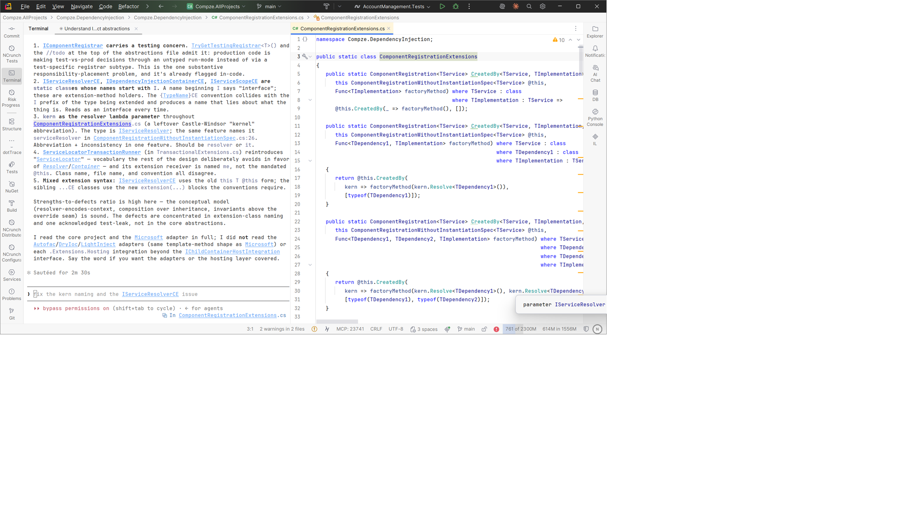
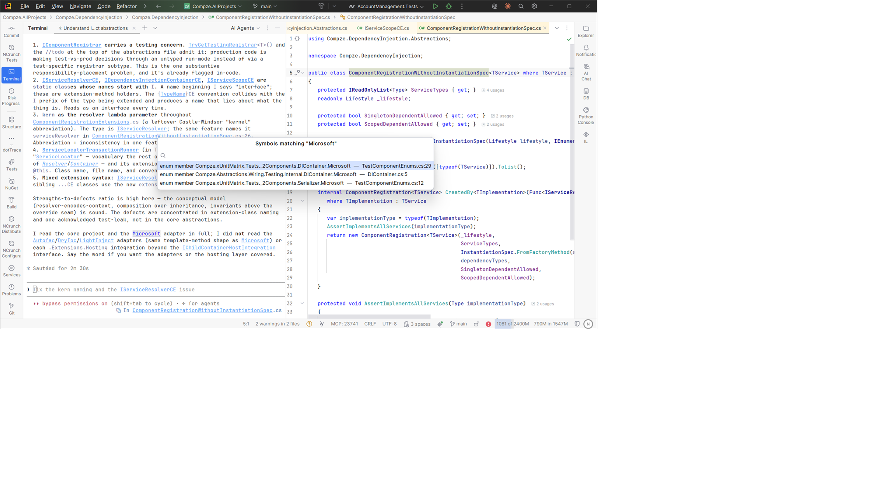

# Rider Terminal Symbol Linker

A JetBrains **Rider** plugin that makes C# **symbol** names in the terminal clickable — click a type
or member name in CLI output and Rider jumps to its declaration. Built for following along with
[Claude Code](https://www.anthropic.com/claude-code) and other CLI tools without keeping a second
editor open just to read their output.

Plain `file:line` links already work in Rider's terminal; bare *symbol names* were the gap. This
fills it, and only linkifies names that are **real solution symbols**, so prose isn't littered with
false links.

[](https://github.com/mlidbom/RiderTerminalSymbolLinker/actions/workflows/build.yml)

## Screenshots

<p align="center">
  <a href="screenshots/Click-link.png"></a>
  <a href="screenshots/Disambiguate-link.png"></a>
</p>

<p align="center"><em>Click a symbol to navigate (left); several declarations open a searchable picker (right). Click an image for full size.</em></p>

## Features

- **Click to navigate.** One declaration → jump straight there. Several → a searchable picker
  (type to filter, like *Go to Symbol*). None → a brief notice. MCP unreachable → falls back to
  Search Everywhere, so a click is never a dead end.
- **Refresh C# Symbol Links** in the terminal's right-click menu — rebuilds the symbol index *and*
  re-highlights output already on screen, so a class you just created lights up retroactively.
- **Instant on open.** A per-solution disk cache makes links work immediately on solution open; a
  fresh index is rebuilt in the background.

## Requirements

- **Rider 2026.1+** (built and tested against 2026.2; the reworked terminal must be the active
  terminal engine).
- The **ReSharper MCP** plugin — [`joshua-light/resharper-mcp`](https://github.com/joshua-light/resharper-mcp),
  listed in Rider as `com.j-light.resharper-mcp` — installed and running. This is what resolves and
  enumerates C# symbols (Rider's own `GotoSymbolModel` does not see them reliably). Without it the
  plugin loads but does nothing.

## Install

1. Download the latest `RiderTerminalSymbolLinker-<version>.zip` from
   [Releases](https://github.com/mlidbom/RiderTerminalSymbolLinker/releases).
2. Rider → **Settings → Plugins → ⚙ → Install Plugin from Disk…** → pick the zip.
3. **Restart** Rider (the `consoleFilterProvider` extension is non-dynamic).

## Build from source

The build needs a **JDK 21** for its Gradle toolchain. If your machine only has a newer JDK/JBR (a
Rider install ships JBR 25, which the toolchain won't use), keep a JDK 21 under `.tooling\jdk` (a
gitignored, machine-local folder) and build through the wrapper, which points `JAVA_HOME` at it **for
that one process only** — nothing global is changed:

```powershell
# Builds the plugin (buildPlugin); zip lands in build\distributions\:
.\build.ps1

# Any arguments forward straight to Gradle:
.\build.ps1 clean buildPlugin --console=plain
```

If you already have a JDK 21 on `JAVA_HOME` (or on the Gradle launcher), you can skip the wrapper and
call Gradle directly:

```bash
# Build against an installed Rider (fast — no platform download):
./gradlew buildPlugin -PlocalIdePath="C:/Users/you/AppData/Local/Programs/Rider"

# Or let it download the pinned stable Rider (what CI does):
./gradlew buildPlugin
```

The plugin zip lands in `build/distributions/`.

Tip: put your local IDE path in your **user** Gradle properties so you don't pass it every time —
add this line to `~/.gradle/gradle.properties`:

```
localIdePath=C:/Users/you/AppData/Local/Programs/Rider
```
